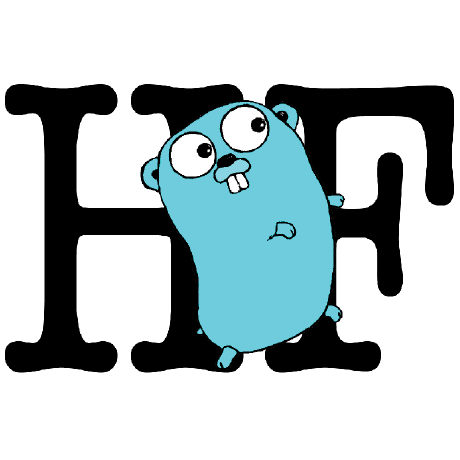

# Brief of Head_First_Go

<br />
<p align="center">
  
</p>
<br />

## Your brain on Go

- Here you are trying learn something, while here your brain is, doing you a favor by making sure the learning doesn't stick. Your brain thinking, _Better leave room for more important things_

### Chapter 1

- [Ready, set, Go!](#ready_set_go)
- [The Go Playground](#the_go_playground)
- [What does it all mean?](#what_does_it_all_mean)
- [Calling functions](#calling_functions)
- [Using functions from other packages](#using_functions_from_other_packages)
- [Function return values](#function_return_values)
- [Strings](#strings)
- [Runes](#runes)
- [Booleans](#booleans)
- [Numbers](#numbers)
- [Types](#types)
- [Declaring variables](#declaring_variables)
- [Zero values](#zero_values)
- [Short variable declarations](#short_variable_declarations)
- [Naming rules](#naming_rules)
- [Conversions](#conversions)
- [Installing Go on your computer](#installing_Go_on_your_computer)
- [Compiling Go code](#compiling_Go_code)

### Chapter 2

- [Calling methods](#calling_methods)
- [Multiple return values from a function or method](#multiple_return_values_from_a_function_or_method)
- [Option 1: Ignore the error return value with the blank identifier](#blank_identifier)
- [Option 2: Handle the error](#handle_the_error)
- [Conditionals](#conditionals)
- [Avoid shadowing names](#avoid_shadowing_names)
- [Blocks](#blocks)
- [Blocks and variable scope](#blocks_and_variable_scope)
- [Only one variable in a short variable declaration has to be new](#only_one_variable_has_to_be_new)
- [Package names vs. import paths](#import_paths)
- [Loops](#loops)
- [Init and post statements are optional](#statements_are_optional)
- [Create guessing game](#create_guessing_game)

---

<div id="ready_set_go" />

## Ready set Go

Back in 2007, the seach engine google had a problem,maintain programs with milions of lines of code that became very difficult, they had to compile the code into a runnable from, a process which at the time took the an hour, that start idea of create language of large scale application

##### why Go lang

- Fast compilation
- Less cumbersome code
- Unused memory freed automatically (garbage collection)
- Easy to write software that does several operations simultaneously
- Good support for processors with multiple cores

One the cool feature about go is it can help you handle many users connecting at once.
And no matter what youre writting, it will help you ensure that your code is easier to maintain and add to.

---

<div id="the_go_playground" />

## The Go Playground

The easiest way to try Go is to visit http://play.golang.org in your web
browser that simple editor where you can enter Go code (Of course this only works if you have a stable internet connection) and its just for simple test and good enough for starting with Go

---

<div id="what_does_it_all_mean" />

## What does it all mean?

Every Go file starts with a package clause. A **Package** is a collection of code that does similar thing, like formatting strings or drawing images.

The special package its main which is required if this code is going to be run directly (usually from the terminal)

Next, Go files almost always have one or more imports statements. Each file needs to import other packages before its code can use the code those other packages contain.

In other word instead you specify only the packages you need by import them

The last part of every Go file is the actual code, which os often split up into one or more functions. A fucntion is a group of one or more lines of code that you can call(run)

Function named main is special and thats a entry point fucntion and you can call another function inside of that

Recap

1. The packages clause
2. Any import statements
3. The actual code

---

<div id="calling_functions" />

## Calling functions

To call functions, type the function name sth like this: **Println()** and a pair of paratheses. Println can take one or more arguments: values and also Println can be called with no arguments and that acutually print a empty new line

---

<div id="using_functions_from_other_packages" />

## Using functions from other packages

Once we have imported the packages. we can access any fucntion it offers by typing the package name, a dot, and the name of the fucntion we want

For example **fmt.Println()**

Notice the function start with Capital letter that becuase of the nature of accessing the Go lang if you declare a function with capital letter
that fucntion of fields are accessible from another package if you declare as lower case that fucntion just belong to only that package

---

<div id="function_return_values" />

## Function return values

Consider this example

```Go

package main

import (
  "math"
  "strings"
)

func main(){
  math.Floor(2.67)
  strings.Title("head first go")
}
```

When we call the fmt.Prrintln function, we don't need to communicate with it any further after that. We pass one or more value for Println to print, and we trust that it printed
But some times a program needs to be abel to call a function and get data back functions in most programming language can have return values: avalue that the function computes and returns to its caller.

---

<div id="strings" />

## Strings

A string is a series of bytes that usually represent text characters. You can define string directly within your code using **string literals**: text between double quotes

Within strings, characters like newlines, tabs, and other charaters that would be hard to include program code can be represented with **escape sequences**: a backslash followed by charters that represent another character.

\n --> A newline charater
\t --> A tab charater
\\" --> Double quotation marks
\\\ --> A backslash

---

<div id="runes" />

## Runes

Whereas strings are usually used to represent a whole series of text characters, Go runes are used to represnt single characters

String literals are written surrounded by double quotation marks ("), but rune literals are written with single quotation marks (')

Go uses the Unicode standard for storing runes. Runes are kept as numeric codes, not the charcter themselves, if you print them you get numeric code in the output like A represent 65 or b represent 66 and etc...

---

<div id="boolean" />

## Booleans

Booleans values can be one of only values: true or false. They are especially useful with conditional statements

---

<div id="numbers" />

## Numbers

You can also define numbers directly in Go
Go treat integers and floating point numbers as different types, so remember that a decimal point can be used to distinguish an integer from a floating-point number

Go basic math operators work just like they do in most other languages.
The + symbol is for addition, - for subtraction, \* for multiplication and / for division

< and > use to compare two values and see if one is less then or greater thatn another. You can use == (thats two equal signs) to see if two values are equal,!= use of checking no equal, <= check for less and equal and last but not least >= check for greater and equal

---

<div id="types" />

## Types

We saw the math.Floor function earlier, which rounds a floating-point number down to the nearest whole number, and also strings.Title function which converts a string to title case but waht would happen if you pass string to Floor and a number to Title

We get an error, values in Go are all classified into different types, for example integers can be used in math operations, strings can be capitalized

Go is **statically typed**, which means that it knows what the types of your values are even before your program runs.

One of the package which is allow us to find out the type of value is reflect package and TypeOf function

---

<div id="declaring_variables" />

## Declaring variables

In Go, a variable is a piece of storage containing a value. you can give a variable a name by using a variable declaration.
Var keyword followed by the desired name and type of values the variable will hold.

```Go
var quantity int
var length,width float64
var customerName string

quantity = 2
customerName = "Damon Cole"
// assigning multiple variables at once
length,width = 1.2, 2.4
```

If you know beforehand what a variable value will be, you can declare variables and assign them values on the same line

Assing new value to existing variabels, need to be values of the same type. Go static typing ensures you do not accidentally assing the wrong kind of value to a variable

Also you can omit the variable type from the declaration when you want to assign and declare at the same time

```Go
var quantity = 4
var length, width = 1.2, 2.4
fmt.Println(reflect.TypeOf(quantity))
```

---

<div id="zero_values" />

## Zero values

If you declare a variable without assigning it a value, that variable will contain the **zero value** for the numeric types, the zero value is actually 0
The zero value for string variable is an empty string, and the zero value for bool variabels is false and for the other its nil

---

<div id="short_variable_declarations" />

## Short variable declarations

A short variable declaration. Instead of explicitly declaring the type of the variable and later assigning to it with =, you do both at once using :=.

```Go
quantity :=  4
length, width := 1.2, 2.4
customerName := "Damon Colee"
```

Because short variable declarations are so convenient and concise, they are used more often that regular declarations.

---

<div id="naming_rules" />

## Naming rules

Go has one simple set of rules that apply to the names of variables,
functions, and types:

- A name must begin with a letter, and can have any number of additional letters and numbers

- If the name of variable, function, or type begins with a capital letter, it is considered **exported**

- If a variable/function/type name begins with a lowercase letter, it is considered **unexported**

- If a name consists of multiple words, each word after the first shoulb be capitalized like this: topPrice, RetryConnection this style called camel case

- When the meaning of a name is obvious from the context, use abbreviate it like this: use i instead of index, max instead of maximum and ...

---

<div id="conversions" />

## Conversions

Math and comparison operations in Go require that the include values be of the same type
But what if you want to compare int to float or convert a string to integer
There is solution for that and use conversions . You just provide the type want to convert a vallue to

```Go
var myInt int = 2
var floatValue := float64(myInt)
```

When making a conversion, be aware of how they might change the resulting
For example, float64 variables can store fractional value but when you convert them to integers
fractional portion is simply dropped

---

<div id="installing_Go_on_your_computer" />

## Installing Go on your computer

1. Visit http://golang.org in your web browser
2. Select the installation package
3. Visit the installation instruction page for your OS
4. Open a new terminal or command prompt window
5. Confirm Go wa installed by typing go version at the prompt and that return go version for you if install correctly

---

<div id="compiling_Go_code" />

## Compiling Go code

1. Using your favorite editor, save your first code
2. Open a new terminal or command prompt
3. In the terminal change dir to where file saved
4. Run go fmt nameFile.go to clean up the code formatting
5. Run go build namFile.go to compile the source code. This will add executable file to currect dir
6. Run the executable file. On linux and macOs with this line **./nameFile** and on windows **namFile.exe**

**Command Description**
go build ==> Compiles source code files into binary files.
go run ==> Compiles and runs a program, without saving an executable file.
go fmt ==> Reformats source files using Go standard formatting.
go version ==> Display the current Go version

---

<div id="calling_methods" />

## Calling methods

Methods: fucntions that are asscociated with values of a given type, the methods that may have seen attached to object in other languages, but they are a bit simpler

The time package has a Time type that represents a date(year, month, day)
Each time.Time value has a Year method that returns the year

The time.Now function returns a new Time value for the current date and time

**Methods are functions that are associated with values of a partucular type.**

```go
string.NewPlacer()
replacer.Replace()
```

---

<div id="multiple_return_values_from_a_function_or_method" />

## Multiple return values from a function or method

In most programming languages, fucntions and methods can only have a single return value, butn in Go they can return any number of values. in most cases function return an additional error value

---

<div id="blank_identifier" />

## Option 1: Ignore the error return value with the blank identifier

When we have a value that would normally be assigned to a variable, but that we do not intend to use, we can use Go **black identifier**, simply type a single underscore (\_) character in an assignment

---

<div id="handle_the_error" />

## Option 2: Handle the error

We can set condition on error and track when error happend and we can use log package which is has a Fatal fucntion that can do both of these Operations for us at once: log a message to the terminal and stop the program : means reporting an error that kills your program

There is lot about error handling we talk about that later

---

<div id="conditionals" />

## Conditionals

Functions and methods like ReadString return an error value of nil, which basically means there is nothing there in other words if err is nil, it means there was no error

An expression is evaluated, and if its result is true, the code in the conditional block body is executed. If its false, the conditional block is skipped

`Conditional rely on a boolean expression`

---

<div id="avoid_shadowing_names" />

## Avoid shadowing names

Naming a variable error would be a bas idea, beacuse it would shadow the name of a type called error you should make sure it dosent have the same name as any existing fucntions,packages,types or other variables
they can be create some issues later in your program

---

<div id="blocks" />

## Blocks

Declaring a variable like status without using it afterward is an error in Go. It seems a little strange that we re getting the error twice, but let disregard that for now
Go code can be decided up into blocks, blocks are usually surrounded by curly braces {}
The bodies of functions and conditinals are both blocks as well

---

<div id="blocks_and_variable_scope" />

## Blocks and variable scope

Eeach variable you declare has a scope: a portion of your code that it visible within. if you inside of scope and try to access variables from outside of scope you will get an error but oposite its can be you have access to variables from outside of scope to inside of scope

---

<div id="only_one_variable_has_to_be_new" />

## Only one variable in a short variable declaration has to be new

Its true that when the same variable is declared twice in tha same scope
we get a compile error

But as long as at least one variable name in short variable declarations is new, its allowed The new variable names are treated as a declaration, and the existing names are treated as an assignment

---

<div id="import_paths" />

## Package names vs. import paths

The math/rand package has a Intn fucntion that can generate a random number for us, so we will need to import math/rand. Then we will call rand. Intn to generate the random number

math/rand refering to the package import path not its name an import path is just a unique string that identifies a package and that you use in an import statement

the Go lang dosent require that a package name have anything to do with import path. but by convetion, the last or only segement of the import path is also used as the package name

so thats why out import statement uses a path of math/rand, but our main function just uses the package name rand

---

<div id="loops" />

## Loops

you have probably encountered loops. When you need one or more statements executed over and over, you place them inside a loop
Loops always begin with the for keyword. for is followed by three segments of code that control the loop:

- An initialization (or init) statement that is usually used to initialize a variable

- A condition expression that deremines when to break out of the loop

- A post statement that runs after each iteration of the loop

this loop print out 1 to 10

```go
for i:=0 ; i<10 ; i++{
  fmt.Println(i)
}
```

---

<div id="statements_are_optional" />

## Init and post statements are optional

if you want, you can leave out the init and post statements from a loop, leaving only the conditon expression

```go
x := 1
for x <= 3 {
  fmt.Println(x)
}
```

also good to know the scope of any variable declared whithin a loops block is limited to that block

---

<div id="create_guessing_game" />

## Create guessing game

```go

package main

import (
  "bufio"
  "fmt"
  "log"
  "os"
  "strconv"
  "stirings"
  "time"
  )

func main() {
  seconds := time.Now().Unix()
  rand.Seed(seconds)
  target := rand.Intn(100)+1
  fmt.Println("I have chosen a random number between 1 and 100")
  fmt.Println("Can you guess it?")

  reader := bufio.NewReader(os.Stdin)
  success := false

  for guesses := 0 ; guesses < 10 ; guesses++ {
    fmt.Println("You have 10-guesses")
    fmt.Print("Make a guess ? ")
    input, err := reader.ReadString("\n")
    if err != nil{
      log.Fatal(err)
    }
    input = strings.TrimSpace(input)
    guess, err := strconv.Atoi(input)
    if err != nil{
      log.Fatal(err)
    }

    if guess < target {
      fmt.Println("Oops your guess was low")
    } else if guess > target{
      fmt.Println("Oops your guess was high")
    }else {
      success = true
      fmt.Println("GOOD JOB!")
      break
    }
  }

  if !success {
    fmt.Println("Sorry, you lost")
  }
}
```
